# Topic: Devops Tooling Website Solution

## Objective : To implement a 3-tier Application Architecture with a single Database and a NFS Server as a Shared Files Storage

## Project Components

- Infrastructure: AWS
- Webserver Linux: Red Hat Enterprise Linux 8
- Database Server: Ubuntu 20.04 + MySQL

- Storage Server: Red Hat Enterprise Linux 8 + NFS Server
- Programming Language: PHP
- Code Repository: GitHub

## Please note that the NFS server. Database severs and the 3 webservers are created in the same security group hence have same subnet CIDR. This is not ideal in a production environment for security reasons

## Configuring the NFS-Sever

## Steps

1. Create and launch the NFS instance.

   Three EBS volumes of 10gb each was created in the same availability zone as the webserver and attached to the webserver instance.

    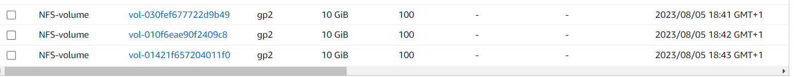

2. Next step was to login to the NFS server instance and configure the disk partitions.

   I used the command below to confirm if the volumes attached above are available in our NFS instance.

        lsblk

     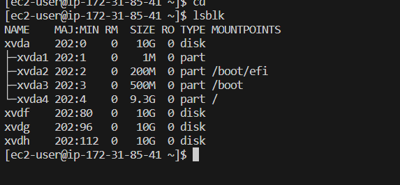

3. After the confirmation, the next step was to partition the instance using the gdisk type of partitioning. 

## Partitioning the NFS-SERVER and creating all Volumes:

1. To confirm the free space on the server, the co:mmand below was used. 

        df -h 

2. To create the partition on  each EBS volume, the command below was used. 

        gdisk /dev/<volume-name> 

    Where volume-name is xvdf, xvdg, xvdh

    **output**
    

3. The gdisk command was repeated to create other partitions. 

4. lvm2 was created with the command below

        sudo yum install lvm2
    run the command below to confirm if lvm has been created
    
        sudo lvmdiskscan

5. To mark my volumes as a physical volume, the command below was used 
    ``````
    sudo pvcreate /dev/xvdf1 
    sudo pvcreate /dev/xvdg1
    sudo pvcreate /dev/xvdh1
    ``````
6. The command below was used to verify if the the volumes have been properly marked as a physical volume

        sudo pvs

    **output**
    

7. Next step is to create a volume group(vg) and attached same to our physical volume created above 

          sudo vgcreate webdata-vg /dev/xvdh1 /dev/xvdg1 /dev/xvdf1

8. To confirm if the volume group has been successfully created the command below was used

         sudo vgs

    **output**
    


9. Next step is to create 2 logical volumes(lv), one to store the app data and the other to store the logs. 
Each of the logical volumes will be assigned 14gb each. 
 
    The command below was used to achieve this 
    ``````
    sudo lvcreate -n apps-lv -L 9G nfsdata-vg 
    sudo lvcreate -n logs-lv -L 9G nfsdata-vg
    sudo lvcreate -n opt-lv -L 9G  nfsdata-vg
    ``````

    To confirm if the lv's have been created, the command below was used

        sudo lvs

    **output**
       

    The entire setup was confirmed with:

        sudo lsblk

    

10. The next step is to format these LV to xfs format

    ``````
    sudo mkfs -t ext4 /dev/nfsdata-vg/apps-lv
    sudo mkfs -t ext4 /dev/nfsdata-vg/logs-lv
    sudo mkfs -t ext4 /dev/nfsdata-vg/opt-lv
    ``````
11. The next action point is to create the mount points for apps. opt and logs respectively

    ``````
    sudo mkdir -p /mnt/apps
    sudo mkdir -p /mnt/logs
    sudo mkdir -p /mnt/opt
    ``````     

12.    Next step is to mount the created /mnt/apps on apps/lv
    
            sudo mount /dev/nfsdata-vg/apps-lv /mnt/apps

    
13. The next step is to mount /mnt/logs on logs-lv logical volume with the command below and mnt/opt on opt-lv
    
            sudo mount /dev/nfsdata-vg/logs-lv /mnt/logs
            sudo mount /dev/nfsdata-vg/opt-lv /mnt/opt

    
    The UUID for the lv's is obtained by using the command below

        sudo blkid

    

14.  The copied UUID is step 18 is pasted into the /etc/fstab with
    
         sudo nano /etc/fstab

     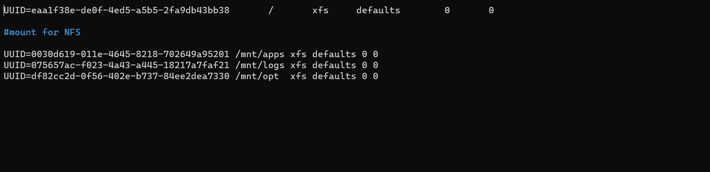

15.  The configiration was tested with the commands below 
     
     ``````
     sudo mount -a
     sudo systemctl daemon-reload
     ``````

16.  The entire setup was confirmed with the command below

         df -h 

     

17. The next step is to install the NFS server with the following commands
       
        sudo yum -y update
        sudo yum install nfs-utils -y
        sudo systemctl start nfs-server.service
        sudo systemctl enable nfs-server.service
        sudo systemctl status nfs-server.service 

    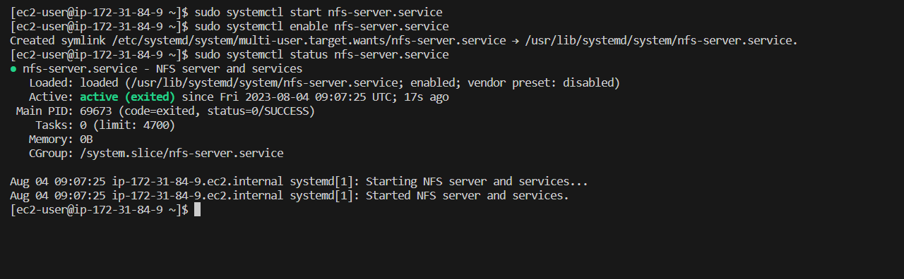
18. The next step is to set up permission that will allow our Web servers to read, write and execute files on NFS with the commands below
     ``````
     sudo chown -R nobody: /mnt/apps
     sudo chown -R nobody: /mnt/logs
     sudo chown -R nobody: /mnt/opt
     sudo chmod -R 777 /mnt/apps
     sudo chmod -R 777 /mnt/logs
     sudo chmod -R 777 /mnt/opt
     sudo systemctl restart nfs-server.service
    ``````
19. Export the subnet CIDR for the NFS server on AWS portal.
       
20. Configure access to NFS for clients within the same subnet (i.e subnect exported in step 19):
    
        sudo vi etc/exports

      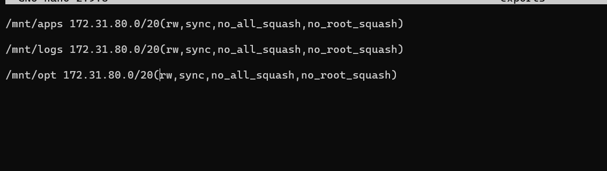
Run the command below after the exports file has been configured as shows above in step 20

        sudo exportfs -arv
    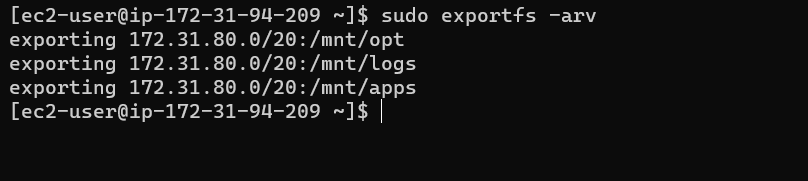

21. confirm the port NFS is listening on and open same on AWS portal

        rpcinfo -p | grep nfs
    
    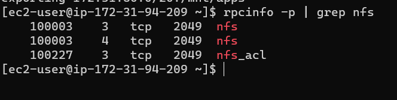

    **Important note: In order for NFS server to be accessible from your client, you must also open following ports: TCP 111, UDP 111, UDP 2049**   
    
    

 # Configuring The Database   
## Steps

1. Run `sudo apt update` to update the repo
2. Run the command below to install mysql server on the instance. 
   
        sudo apt install mysql-server
3. Start, enable and confirm the status of the mysql service with the commands below 

        sudo systemctl start mysql
        sudo systemctl enable mysql
        sudo systemctl status mysql

        
4. Use the commands below to create datebase called tooling, user called webaccess and grant all access on the created table to the webaccess user from the webservers CIDR. 
    ``````    
        sudo mysql
        create database tooling;
        create user 'webaccess'@'172.31.80.0/20' identified by 'pass';
        grant all privileges on tooling.* to 'webaccess'@'172.31.80.0/20';
    ``````
    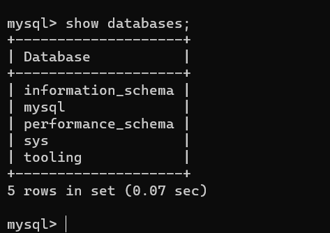    
    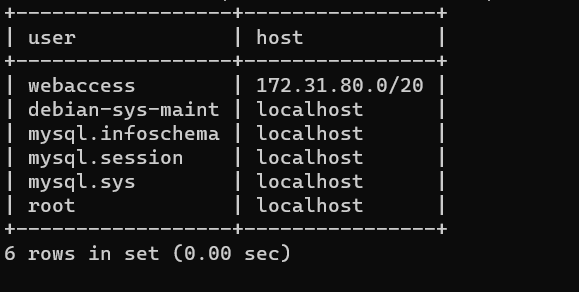
5. locate the mysql config file and change the bind address to 0.0.0.0 as this will enable the sql server recieve remote connections

   

# Configuring the webservers.

1. Launch the new instance with RHEL 8 Operatiing system. 
2. Install NFS client with the command below: 
   
            sudo yum install nfs-utils nfs4-acl-tools -y
3. Create a www folder in the var directory with and target theNFS server's for export for apps

             sudo mkdir /var/www   
             sudo mount -t nfs -o rw,nosuid <NFS-Server-Private-IP-Address>:/mnt/apps /var/www

4. confirm if the NFS was mounted successfully by running
   
        df -h
5. Make the changes persist after reboot by adding the line below to `/etc/fstab`
        
        <NFS-Server-Private-IP-Address>:/mnt/apps /var/www nfs defaults 0 0

6. Locate the location for RHEL log files `cd /var/log/httpd`
7. Mount the located file on withe the 2nd  command in step 3
8. Repeat step 4 to 5 
9. install Remi's repo, apache and php with the commands below.
    ``````
    sudo yum install httpd -y

    sudo dnf install https://dl.fedoraproject.org/pub/epel/epel-release-latest-8.noarch.rpm

    sudo dnf install dnf-utils http://rpms.remirepo.net/enterprise/remi-release-8.rpm

    sudo dnf module reset php

    sudo dnf module enable php:remi-7.4

    sudo dnf install php php-opcache php-gd php-curl php-mysqlnd

    sudo systemctl start php-fpm

    sudo systemctl enable php-fpm

    sudo setsebool -P httpd_execmem 1
    ``````
10. Repear steps 1. to 9. for other two webservers
     
11. Confirm the apache fiels and directories on the webservers in /var/www are also on the NFS server in /mnt/apps
          
12. Install git on your instance with the command: 
    
        sudo yum install git

13. Clone the repo https://github.com/darey-io/tooling.git 
14. cd into the cloned repo with:
 
        cd tooling   
15. Copy the content of the html file to var/www/html 

        cp -r html/. /var/www/html        

16. Open the TCP port 80 on the webserver.
     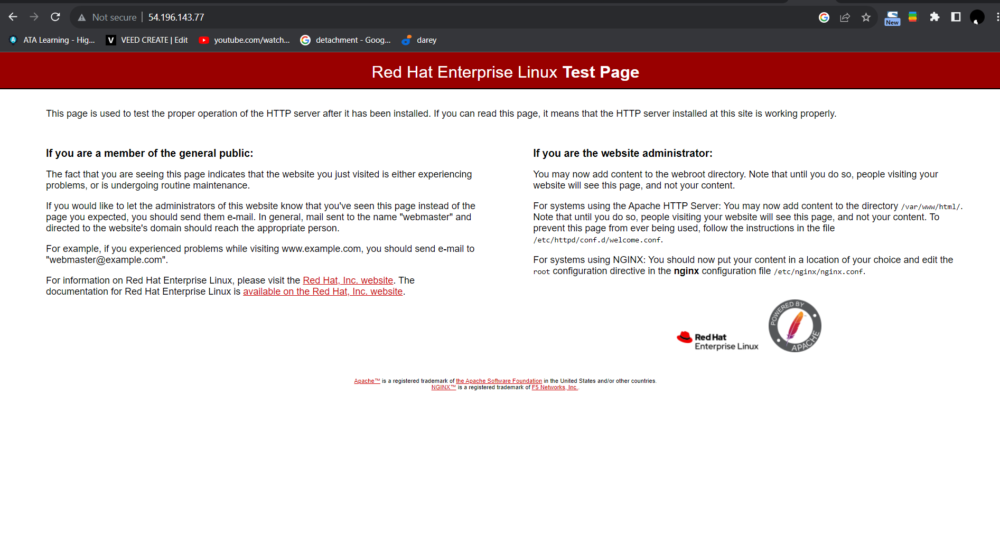
17. Update the websites's confirguration to connect to the database by updating the function.php file in the hmtl folder copied in step 14 
        
        sudo vi /var/www/html/function.php
       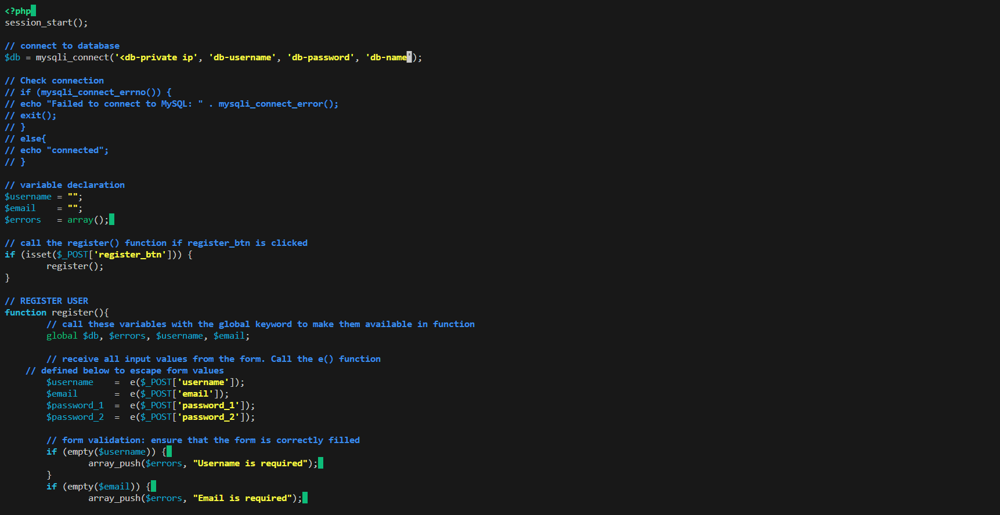   
18. cd into the tooling directory of webserver 1and apply tooling-db.sql script to the database using te command: 

        mysql -h <databse-private-ip> -u <db-username> -p <db-name> < tooling-db.sql

19. Open the website in your browser with the webserver's public IP and login with the website `username:my user` and password `user`

    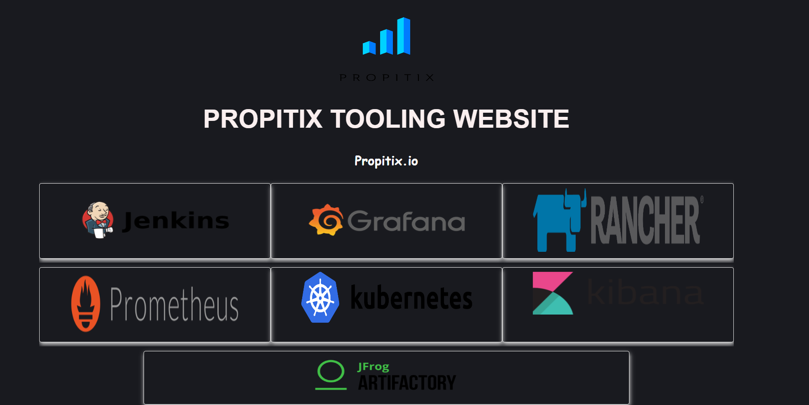

## End
